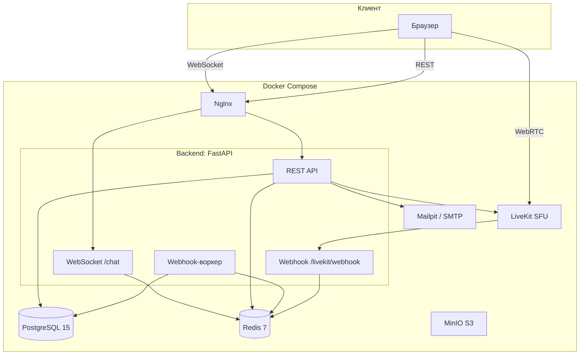

# Платформа для онлайн-занятий

Платформа для проведения онлайн-уроков с видео/аудио связью через WebRTC (LiveKit), встроенным чатом и системой управления курсами.

## Стек технологий

| Слой | Технология |
|------|-----------|
| Язык | Python 3.12+ |
| Фреймворк | FastAPI 0.136 |
| ORM | SQLModel + SQLAlchemy 2.0 (async) |
| База данных | PostgreSQL 15 |
| Кэш / Pub-Sub / Rate-limit | Redis 7 |
| WebRTC SFU | LiveKit v1.8 |
| Объектное хранилище (dev) | MinIO |
| Почта (dev) | Mailpit |
| Контейнеризация | Docker + Docker Compose |
| Тестирование | pytest + pytest-asyncio |

## Возможности

- **Аутентификация** — двухшаговая регистрация с подтверждением email (6-значный код), JWT access/refresh токены с httponly cookies
- **Роли пользователей** — `student`, `teacher`, `admin` с централизованной матрицей разрешений
- **Курсы** — создание, редактирование, slug-based URL, деактивация
- **Уроки** — жизненный цикл scheduled → running → ended, управление из API
- **Видео/аудио связь** — WebRTC через LiveKit, автоматическая выдача токенов участникам
- **Чат** — WebSocket с трансляцией через Redis Pub/Sub (без эха отправителю), история сохраняется в БД
- **Приглашения** — invite-ссылки с лимитом использований и сроком действия
- **Преподаватели** — назначение нескольких преподавателей на курс
- **Участники** — управление составом курса
- **Логи посещений** — запись входов/выходов через LiveKit-webhook с батчевой записью в БД
- **Rate-limiting** — на регистрацию, вход, отправку и проверку кода подтверждения
- **Единый формат ответов** — `ApiResponse[T]` для всех эндпоинтов

## Быстрый старт

### 1. Генерация `.env`

```bash
python generate_env.py
```

Скрипт запросит пароли для PostgreSQL и Redis, остальные секреты сгенерирует автоматически.

### 2. Запуск (development)

```bash
docker compose -f docker-compose-dev.yml up --build
```

После запуска будут доступны:

- **API:** http://localhost:8000
- **Swagger:** http://localhost:8000/docs
- **ReDoc:** http://localhost:8000/redoc
- **Mailpit (почта):** http://localhost:8025
- **MinIO Console:** http://localhost:9001
- **LiveKit API:** http://localhost:7881

### 3. Production-запуск

```bash
# В .env выставить ENVIRONMENT=production
docker compose up --build
```

## Учётная запись администратора

При первом запуске автоматически создаётся администратор с почтой и паролем из `.env`:

- **`DEFAULT_ADMIN_EMAIL`** — почта (по умолчанию `admin@example.com`)
- **`DEFAULT_ADMIN_PASSWORD`** — пароль (≥12 символов, обязателен к переопределению)

## Архитектура



### Ключевые архитектурные решения

**WebHook-буфер (Redis → батч → PostgreSQL)**
LiveKit отправляет события `participant_joined` / `participant_left` на вебхук. Сервер мгновенно кладёт их в Redis-список и отвечает 200. Фоновый воркер раз в 5 секунд забирает накопленные события и пишет их батчем в `lessons_logs`.

```
LiveKit  →  POST /livekit/webhook  →  LPUSH Redis buffer  →  200 OK
                                          ↓ (каждые 5 сек)
                                     Воркер: LRANGE + DEL
                                          ↓
                                     Батч INSERT/UPDATE в lessons_logs
```

**Чат через Redis Pub/Sub**
Сообщения не ходят напрямую между WebSocket-ами. Отправитель пишет в Redis-канал, все подписчики (включая другие инстансы) получают сообщение. Отправитель фильтруется по `sender_id`.

**LiveKit-комнаты**
Имя комнаты формируется как `course_{course_id}_lesson_{lesson_id}`. Токен выдаётся с правами `join + publish + subscribe`, TTL = 1 час.

## Структура проекта

```
platform_for_online_lesson/
├── backend/
│   ├── api/
│   │   ├── bootstrap/          # Запуск приложения, lifespan, seed
│   │   │   ├── create_app.py   # Сборка FastAPI: роутеры, middleware, exception handlers
│   │   │   ├── lifespan.py     # Startup/shutdown: БД, Redis, воркер, seed админа
│   │   │   ├── pre_startup.py  # Прогон тестов перед запуском (production)
│   │   │   ├── seed.py         # Создание дефолтного админа
│   │   │   └── exception_handlers.py
│   │   ├── core/               # Инфраструктурный слой
│   │   │   ├── config.py       # Pydantic Settings, валидация .env
│   │   │   ├── database.py     # AsyncEngine, сессии
│   │   │   ├── redis.py        # RedisClient + RedisPubSub
│   │   │   ├── redis_keys.py   # Централизованные ключи и TTL
│   │   │   ├── livekit_service.py  # Генерация LiveKit-токенов
│   │   │   ├── websocket.py    # ConnectionManager для чата
│   │   │   ├── webhook_worker.py   # Батчевая запись логов уроков
│   │   │   ├── permissions.py  # Ролевая матрица Permission
│   │   │   ├── access_helpers.py   # Проверки доступа (get_course_or_404, etc.)
│   │   │   └── response.py     # ApiResponse[T] обёртка
│   │   ├── endpoints/
│   │   │   ├── auth/           # Регистрация, вход, refresh, teacher_invites
│   │   │   ├── chat/           # WebSocket-чат
│   │   │   ├── courses/        # CRUD курсов + уроки + invites + teachers + memberships
│   │   │   ├── join/           # Присоединение к курсу по invite-токену
│   │   │   ├── lessons_logs/   # Сервис логов уроков
│   │   │   ├── livekit/        # Webhook LiveKit
│   │   │   └── users/          # CRUD пользователей
│   │   └── main.py             # Точка входа (uvicorn)
│   ├── models/                 # SQLModel-модели (10 таблиц)
│   ├── tests/                  # pytest
│   └── docs/                   # Документация
├── data/                       # Docker-volumes (postgres, redis, minio, livekit)
├── .env                        # Переменные окружения (секреты)
├── Dockerfile
├── docker-compose.yml          # Production
├── docker-compose-dev.yml      # Development (+ MinIO, Mailpit, LiveKit)
├── generate_env.py             # Скрипт генерации .env (Windows/Linux/macOS)
├── livekit-egress.yaml         # Конфиг для записи занятий (опционально)
├── pyproject.toml
└── requirements.txt
```

## База данных

10 таблиц, спроектированных под MVP платформы онлайн-обучения:

| Таблица | Назначение |
|---------|-----------|
| `users` | Пользователи (студенты, преподаватели, админы) |
| `courses` | Курсы (контейнеры для уроков) |
| `lessons` | Уроки внутри курса, жизненный цикл scheduled→running→ended |
| `lessons_logs` | Логи посещения уроков (webhook-события LiveKit) |
| `chat_messages` | Сообщения чата внутри курса |
| `courses_livekit_tokens` | Аудит выданных LiveKit-токенов |
| `course_invites` | Invite-ссылки для вступления в курс |
| `course_memberships` | Участники курса |
| `course_teachers` | Назначенные преподаватели курса |
| `teacher_invites` | Токены для регистрации преподавателей |

Подробная ER-диаграмма: [backend/docs/TABLE.md](backend/docs/TABLE.md)

## API

Полная спецификация: [backend/docs/API_SPEC.md](backend/docs/API_SPEC.md)

Краткий обзор эндпоинтов:

| Группа | Эндпоинты |
|--------|-----------|
| **Auth** | `POST /auth/register`, `POST /auth/verify`, `POST /auth/login`, `POST /auth/refresh` |
| **Users** | `GET/PATCH /users/me`, `GET /users/`, `GET/PATCH /users/{id}`, `POST /users/set-active`, `POST /users/delete` |
| **Courses** | `POST /courses/create`, `GET /courses/my`, `GET/PATCH/DELETE /courses/{slug}` |
| **Lessons** | `POST/GET /courses/{slug}/lessons`, `GET/PATCH /courses/{slug}/lessons/{id}`, `POST .../start`, `POST .../end`, `GET .../token`, `GET .../logs` |
| **Invites** | `POST/GET/DELETE /courses/{slug}/invites` |
| **Join** | `POST /invites/join` |
| **Teachers** | `POST/GET/DELETE /courses/{slug}/teachers` |
| **Members** | `GET/DELETE /courses/{slug}/members` |
| **Teacher invites** | `POST/GET/PATCH/DELETE /admin/teacher-invites` |
| **Chat** | `WS /ws/chat/{course_id}` |
| **Webhook** | `POST /livekit/webhook` |

## Переменные окружения

| Переменная | Описание |
|-----------|----------|
| `ENVIRONMENT` | `development` или `production` |
| `POSTGRES_USER` | Пользователь PostgreSQL |
| `POSTGRES_PASSWORD` | Пароль PostgreSQL (≥12 символов) |
| `POSTGRES_DB` | Имя базы данных |
| `REDIS_HOST` | Хост Redis |
| `REDIS_PORT` | Порт Redis |
| `REDIS_PASSWORD` | Пароль Redis (≥12 символов) |
| `JWT_SECRET_KEY` | Секрет для подписи JWT |
| `WEBHOOK_SECRET` | Секрет для проверки SHA-256 подписи LiveKit-webhook |
| `DEFAULT_ADMIN_EMAIL` | Почта дефолтного админа (создаётся при первом запуске) |
| `DEFAULT_ADMIN_PASSWORD` | Пароль дефолтного админа (≥12 символов) |
| `LIVEKIT_API_KEY` | LiveKit API Key |
| `LIVEKIT_API_SECRET` | LiveKit API Secret |
| `LIVEKIT_WS_URL` | URL WebSocket LiveKit-сервера |
| `SMTP_HOST` | SMTP-хост (в dev: `mailpit`) |
| `SMTP_PORT` | SMTP-порт |
| `SMTP_FROM_EMAIL` | Адрес отправителя |
| `SMTP_PASSWORD` | Пароль SMTP |

## Тестирование

```bash
# Все тесты
python -m pytest backend/tests/ -v

# С coverage
python -m pytest backend/tests/ --cov=backend --cov-report=term
```

В production-окружении тесты запускаются автоматически при старте приложения (pre-startup hook). При падении любого теста приложение не запустится.

## Лицензия

MIT
