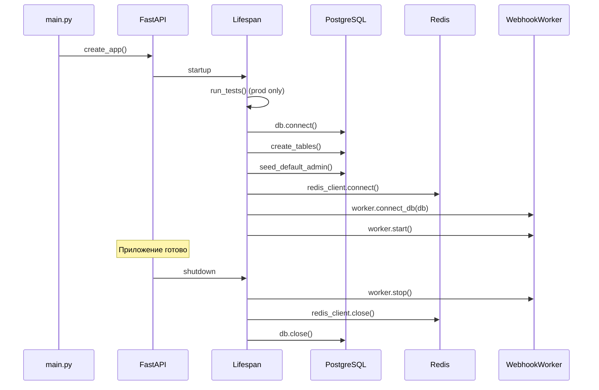
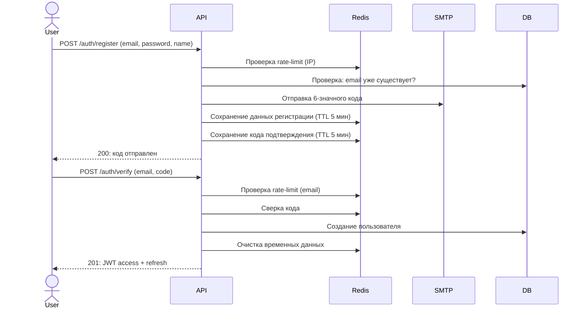
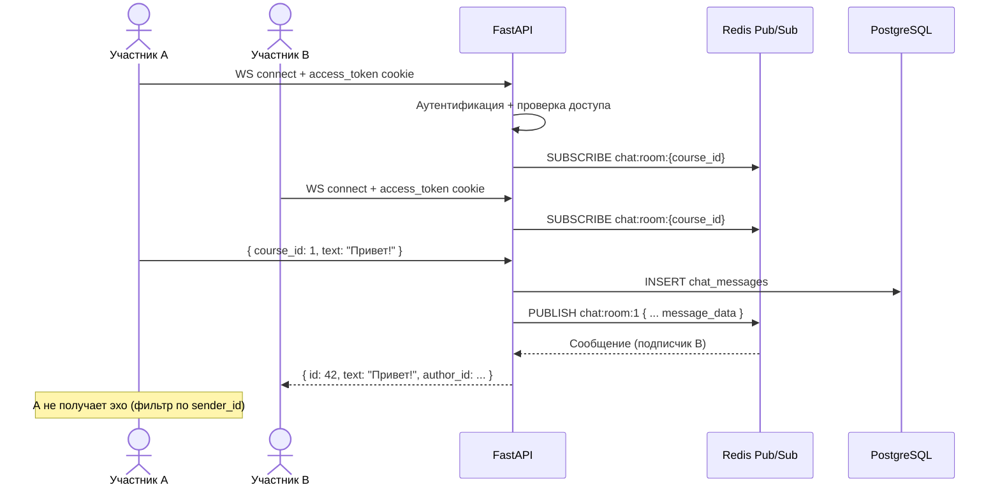
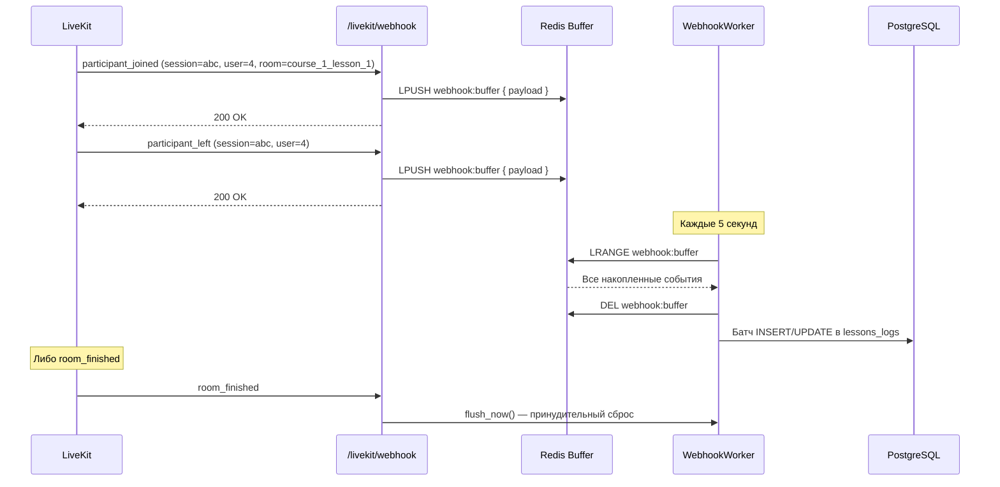

# 📚 Документация платформы

## Содержание

- **[Схема базы данных](TABLE.md)** — ER-диаграмма, описание всех 10 таблиц и связей
- **[Спецификация API](API_SPEC.md)** — Полный перечень эндпоинтов с request/response примерами

## Обзор архитектуры

### Слои приложения

Приложение построено по модульной архитектуре с разделением на три слоя:

```
backend/api/
├── bootstrap/     # Точка сборки: создание FastAPI, lifespan, seed
├── core/          # Инфраструктура: БД, Redis, LiveKit, WebSocket, конфиг
└── endpoints/     # Бизнес-логика: роутеры, схемы, сервисы
```

### Принципы

1. **Единый формат ответов** — все эндпоинты возвращают `ApiResponse[T]`
   ```json
   {
       "is_success": true,
       "message": "OK",
       "status_code": 200,
       "data": { ... }
   }
   ```

2. **Централизованная матрица разрешений** — `RolePermissions` в `core/permissions.py` определяет, какие роли (`student`, `teacher`, `admin`) могут выполнять какие действия

3. **Батчевая запись логов** — webhook-события LiveKit не пишутся в БД по одному; они накапливаются в Redis-буфере и сбрасываются батчем каждые 5 секунд

4. **Чат через Pub/Sub** — WebSocket-сообщения идут через Redis Pub/Sub, что делает систему масштабируемой на несколько инстансов

5. **Pre-startup тесты** — в production перед поднятием API автоматически прогоняются тесты. При падении — запуск блокируется

### Жизненный цикл приложения



## Модели данных

Всего 10 таблиц SQLModel (SQLAlchemy async):

| Таблица | Файл |
|---------|------|
| `users` | `backend/models/users.py` |
| `courses` | `backend/models/courses.py` |
| `lessons` | `backend/models/lessons.py` |
| `lessons_logs` | `backend/models/lessons_logs.py` |
| `chat_messages` | `backend/models/chat_messages.py` |
| `courses_livekit_tokens` | `backend/models/courses_livekit_tokens.py` |
| `course_invites` | `backend/models/course_invites.py` |
| `course_memberships` | `backend/models/course_memberships.py` |
| `course_teachers` | `backend/models/course_teachers.py` |
| `teacher_invites` | `backend/models/teacher_invites.py` |

Полная ER-диаграмма и описание связей: **[TABLE.md](TABLE.md)**

## Поток регистрации



## WebSocket-чат



## Webhook LiveKit → логи уроков



## Переменные окружения

| Переменная | По умолчанию | Описание |
|-----------|-------------|----------|
| `ENVIRONMENT` | `development` | `development` или `production` |
| `DATABASE_HOST` | `database` | Хост PostgreSQL |
| `POSTGRES_USER` | `postgres` | Имя пользователя БД |
| `POSTGRES_PASSWORD` | — | Пароль БД (≥12 символов) |
| `POSTGRES_DB` | `db` | Имя базы данных |
| `REDIS_HOST` | `redis` | Хост Redis |
| `REDIS_PORT` | `6379` | Порт Redis |
| `REDIS_PASSWORD` | — | Пароль Redis (≥12 символов) |
| `JWT_SECRET_KEY` | — | Секрет подписи JWT |
| `WEBHOOK_SECRET` | — | Секрет валидации SHA-256 подписи LiveKit-webhook |
| `DEFAULT_ADMIN_EMAIL` | `admin@example.com` | Почта дефолтного админа |
| `DEFAULT_ADMIN_PASSWORD` | — | Пароль дефолтного админа (≥12 символов) |
| `LIVEKIT_HOST` | `livekit` | Хост LiveKit |
| `LIVEKIT_API_KEY` | — | API-ключ LiveKit |
| `LIVEKIT_API_SECRET` | — | API-секрет LiveKit |
| `LIVEKIT_WS_URL` | `ws://livekit:7880` | WebSocket-URL LiveKit |
| `SMTP_HOST` | `smtp.yandex.ru` | SMTP-хост (в dev: `mailpit`) |
| `SMTP_PORT` | `465` | SMTP-порт (в dev: `1025`) |
| `SMTP_FROM_EMAIL` | `noreply@example.com` | Email отправителя |
| `SMTP_PASSWORD` | — | SMTP-пароль |
| `ACCESS_JWT_TOKEN_EXPIRES_IN_MINUTES` | `30` | TTL access-токена |
| `REFRESH_JWT_TOKEN_EXPIRES_IN_DAYS` | `7` | TTL refresh-токена |
| `VERIFICATION_CODE_TTL_IN_MINUTES` | `5` | TTL кода подтверждения |

## Rate-limiting

| Операция | Ключ | Лимит | Окно |
|----------|------|-------|------|
| Регистрация | IP | 5 | 30 сек |
| Вход | IP | 10 | 30 сек |
| Отправка кода | Email | 1 | 30 сек |
| Проверка кода | Email | 5 | 10 сек |

Все лимиты заданы в `core/redis_keys.py`.
