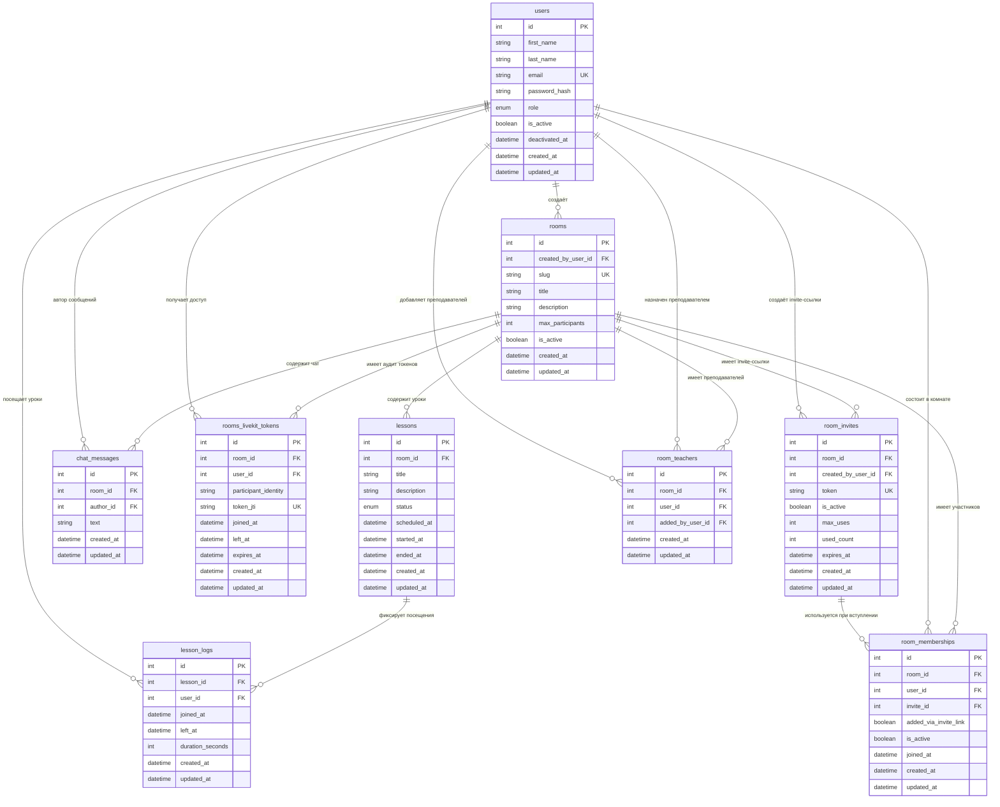

# Диаграмма таблиц

## Пояснения по таблицам

### `users`
Основная таблица пользователей платформы.

Хранит:
- ФИО пользователя
- email
- хеш пароля
- роль (`student`, `teacher`, `admin`)
- состояние аккаунта (`is_active`, `deactivated_at`)
- даты создания и обновления

Используется как центральная сущность почти во всех остальных таблицах.

---

### `rooms`
Таблица комнат.

По текущей логике проекта `room` — это не конкретный урок во времени, а постоянная сущность-контейнер:
- пространство для занятий
- место, где хранятся уроки
- участники комнаты
- преподаватели комнаты
- invite-ссылки
- сообщения чата

Поле `created_by_user_id` показывает, кто создал комнату.

---

### `lessons`
Таблица конкретных занятий внутри комнаты.

`lesson` — это уже событие во времени, а не контейнер.

Хранит:
- к какой комнате относится урок
- название и описание
- плановое время начала (`scheduled_at`)
- фактическое время начала (`started_at`)
- фактическое время завершения (`ended_at`)
- статус урока (`scheduled`, `running`, `ended`)

Именно здесь живет жизненный цикл занятия.

---

### `lesson_logs`
Таблица логов посещения уроков.

Нужна для статистики, аналитики и отчетности.

Позволяет хранить:

- кто зашел на урок
- когда зашел
- когда вышел
- сколько времени присутствовал

Это одна из самых полезных таблиц для администрации школы, потому что по ней можно строить отчеты по посещаемости и активности.
---

### `chat_messages`
Таблица сообщений чата внутри комнаты.

Хранит:
- комнату сообщения
- автора сообщения
- текст
- даты создания и обновления

Используется для текстовой коммуникации внутри учебной комнаты.

---

### `rooms_livekit_tokens`
Таблица аудита токенов LiveKit.

Важно: здесь не хранится сам access token. Вместо этого хранятся только метаданные:
- пользователь
- комната
- `participant_identity`
- `token_jti`
- время выдачи/использования
- время выхода
- срок действия токена

Назначение таблицы:
- аудит доступа к LiveKit
- отладка
- безопасность
- аналитика по подключениям

---

### `room_invites`
Таблица invite-ссылок для вступления в комнату.

Хранит:
- к какой комнате относится приглашение
- кто его создал
- токен приглашения
- активно ли приглашение
- лимит использований
- сколько раз уже использовано
- срок действия

Эта таблица нужна для логики вступления по ссылке.

---

### `room_memberships`
Таблица фактов участия пользователей в комнатах.

Она не хранит invite-ссылку как строку, а фиксирует именно факт:
- пользователь состоит в комнате
- как он был добавлен
- через какой invite он вошел
- активен ли membership

Это нормализованная связующая таблица между `users` и `rooms`.

---

### `room_teachers`
Таблица назначений преподавателей в комнату.

Нужна, потому что одна комната может иметь:
- одного создателя
- нескольких преподавателей с доступом

Хранит:
- какую комнату дали преподавателю
- какого преподавателя добавили
- кто именно его добавил

Таким образом:
- `rooms.created_by_user_id` отвечает за создателя комнаты
- `room_teachers` отвечает за дополнительных преподавателей

---

## Пояснения по связям

### `users -> rooms`
Один пользователь может создать много комнат.

### `rooms -> lessons`
Одна комната может содержать много уроков.

### `lessons -> lesson_logs`
У одного урока может быть много записей посещения.

### `users -> lesson_logs`
Один пользователь может иметь много логов посещения разных уроков.

### `rooms -> chat_messages`
В одной комнате может быть много сообщений чата.

### `users -> chat_messages`
Один пользователь может отправить много сообщений.

### `rooms -> rooms_livekit_tokens`
У одной комнаты может быть много аудиторских записей по токенам LiveKit.

### `users -> rooms_livekit_tokens`
Один пользователь может получать доступ к LiveKit многократно.

### `rooms -> room_invites`
Одна комната может иметь много invite-ссылок.

### `users -> room_invites`
Один пользователь может создать много invite-ссылок.

### `rooms -> room_memberships`
В одной комнате может быть много участников.

### `users -> room_memberships`
Один пользователь может состоять во многих комнатах.

### `room_invites -> room_memberships`
Одно приглашение может привести к нескольким вступлениям, если у него разрешено многократное использование.

### `rooms -> room_teachers`
У одной комнаты может быть много назначенных преподавателей.

### `users -> room_teachers`
Один пользователь может быть назначен преподавателем в нескольких комнатах.

---

## Краткая логика предметной области

Если очень коротко:
- `room` — это учебное пространство
- `lesson` — это конкретное занятие внутри пространства
- `room_invite` — это способ вступления
- `room_membership` — это факт участия пользователя в комнате
- `room_teacher` — это назначение преподавателя в комнату
- `lesson_log` — это факт посещения конкретного занятия
- `rooms_livekit_tokens` — это аудит доступа к LiveKit

Такая схема уже подходит для MVP и покрывает:
- комнаты
- уроки
- участников
- преподавателей
- приглашения
- чат
- статистику посещаемости
- аудит live-подключений
