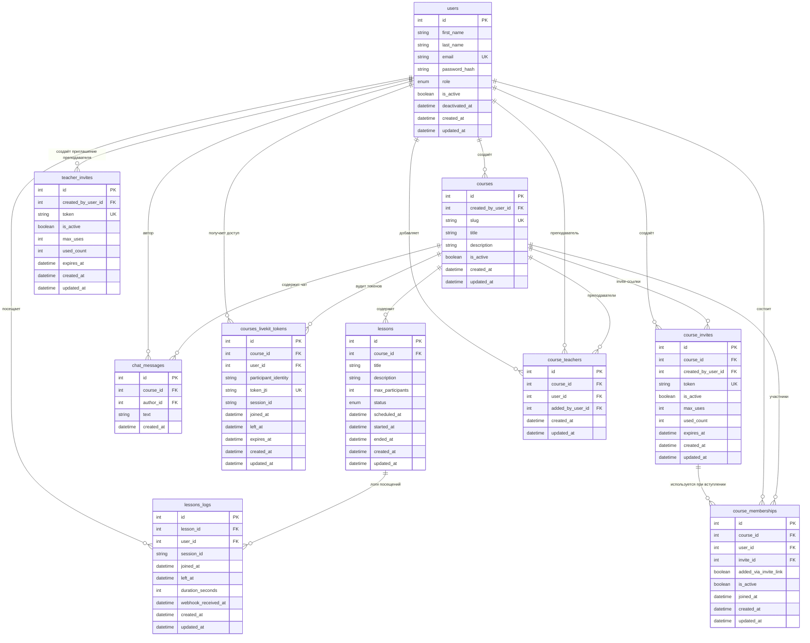

# Диаграмма таблиц

---

## Пояснения по таблицам

### `users`
Основная таблица пользователей платформы.

Хранит:
- Имя и фамилию
- Email (уникальный)
- Хеш пароля (bcrypt)
- Роль (`student`, `teacher`, `admin`)
- Флаг `is_active` (деактивация без удаления)
- Даты создания и обновления

Индексы: `email` (unique), `role`, `is_active`.

---

### `courses`
Курс — контейнер, объединяющий уроки, участников, преподавателей, чат и приглашения.

Поля:
- `slug` — уникальный URL-идентификатор (генерируется автоматически из названия)
- `title` — до 60 символов
- `description` — 10–300 символов
- `created_by_user_id` — создатель курса (FK → users, `ondelete=RESTRICT`)
- `is_active` — деактивация без удаления

---

### `lessons`
Конкретное занятие внутри курса с жизненным циклом.

Статусы:
- `scheduled` — запланировано
- `running` — идёт прямо сейчас
- `ended` — завершено

Поля:
- `course_id` — FK → courses (`ondelete=CASCADE`)
- `scheduled_at` — плановое время начала
- `started_at` — фактическое время начала (устанавливается при старте)
- `ended_at` — фактическое время завершения
- `max_participants` — 1–50 (по умолчанию 50)

Check-constraint: `ended_at >= started_at` (если оба заданы).

---

### `lessons_logs`
Логи посещения уроков — самая важная таблица для аналитики и отчётности.

Заполняется автоматически через webhook-события LiveKit (не через прямое API).

Поля:
- `lesson_id` — FK → lessons (`ondelete=CASCADE`)
- `user_id` — FK → users (`ondelete=RESTRICT`)
- `session_id` — идентификатор LiveKit-сессии (для матчинга join/leave)
- `joined_at` — время входа
- `left_at` — время выхода
- `duration_seconds` — автовычисляемая длительность присутствия
- `webhook_received_at` — время получения события сервером (для мониторинга задержек)

Индексы:
- Частичный уникальный индекс на `(lesson_id, user_id) WHERE left_at IS NULL` — один пользователь не может иметь две открытые сессии на одном уроке
- `(lesson_id, user_id, joined_at)` — для быстрых отчётов

Check-constraints:
- `left_at >= joined_at`
- `duration_seconds >= 0`

---

### `chat_messages`
Сообщения чата курса. Сохраняются в БД при отправке через WebSocket.

Поля:
- `course_id` — FK → courses (`ondelete=CASCADE`)
- `author_id` — FK → users (`ondelete=RESTRICT`)
- `text` — 1–500 символов
- `created_at` — время отправки (индексировано)

---

### `courses_livekit_tokens`
Аудит выданных LiveKit-токенов. **Не хранит сами токены** — только метаданные: кто, в какой курс, когда получил доступ.

Поля:
- `participant_identity` — строковое представление `user_id`
- `token_jti` — уникальный идентификатор JWT-токена
- `session_id` — идентификатор LiveKit-сессии
- `joined_at` / `left_at` — время использования токена
- `expires_at` — срок действия токена

Check-constraints:
- `left_at >= joined_at`
- `expires_at >= created_at`

---

### `course_invites`
Invite-ссылки для вступления в курс. Создаются преподавателем или админом.

Поля:
- `token` — уникальный токен приглашения
- `is_active` — можно деактивировать без удаления
- `max_uses` — лимит использований (null = безлимитно)
- `used_count` — сколько раз уже использовано
- `expires_at` — срок действия (null = бессрочно)

Check-constraints:
- `max_uses > 0` (если задан)
- `used_count >= 0`
- `expires_at >= created_at` (если задан)

---

### `course_memberships`
Связующая таблица: факт участия пользователя в курсе.

Поля:
- `course_id` + `user_id` — уникальная пара (UniqueConstraint)
- `invite_id` — через какой инвайт вступил (`ondelete=SET NULL`)
- `added_via_invite_link` — флаг способа добавления
- `is_active` — активность участия
- `joined_at` — дата вступления

---

### `course_teachers`
Назначение преподавателей на курс (помимо создателя).

Поля:
- `course_id` + `user_id` — уникальная пара (UniqueConstraint)
- `added_by_user_id` — кто добавил преподавателя

---

### `teacher_invites`
Токены для регистрации преподавателей. Администратор генерирует токен и передаёт преподавателю. При регистрации с валидным токеном пользователь получает роль `teacher`.

Поля:
- `token` — уникальный токен
- `created_by_user_id` — создавший админ
- `is_active`, `max_uses`, `used_count`, `expires_at` — аналогично `course_invites`

---

## Связи

| Связь | Тип | Описание |
|-------|-----|----------|
| `users → courses` | 1:N | Пользователь может создать много курсов |
| `courses → lessons` | 1:N | Курс содержит уроки |
| `lessons → lessons_logs` | 1:N | Урок имеет много записей посещения |
| `users → lessons_logs` | 1:N | Пользователь посещает много уроков |
| `courses → chat_messages` | 1:N | Курс содержит сообщения чата |
| `users → chat_messages` | 1:N | Пользователь — автор многих сообщений |
| `courses → courses_livekit_tokens` | 1:N | Курс имеет много записей аудита токенов |
| `users → courses_livekit_tokens` | 1:N | Пользователь получал доступ многократно |
| `courses → course_invites` | 1:N | Курс имеет много invite-ссылок |
| `users → course_invites` | 1:N | Пользователь создал много приглашений |
| `courses → course_memberships` | 1:N | В курсе много участников |
| `users → course_memberships` | 1:N | Пользователь состоит во многих курсах |
| `course_invites → course_memberships` | 1:N | Приглашение приводит к вступлениям |
| `courses → course_teachers` | 1:N | Курс имеет много преподавателей |
| `users → course_teachers` | 1:N | Пользователь преподаёт на многих курсах |
| `users → teacher_invites` | 1:N | Админ создаёт много токенов для преподавателей |

---

## Краткая логика предметной области

- **`course`** — учебное пространство, контейнер
- **`lesson`** — конкретное занятие внутри курса со своим временем и статусом
- **`course_invite`** — способ вступления в курс по ссылке
- **`course_membership`** — факт участия пользователя в курсе
- **`course_teacher`** — назначение преподавателя (помимо создателя)
- **`teacher_invite`** — токен для получения роли `teacher` при регистрации
- **`lesson_log`** — факт посещения конкретного занятия (аналитика)
- **`courses_livekit_tokens`** — аудит доступа к видео/аудио

Схема покрывает потребности MVP:
- Курсы и уроки
- Участники и преподаватели
- Приглашения
- Чат в реальном времени
- Статистика посещаемости
- Аудит подключений к LiveKit
