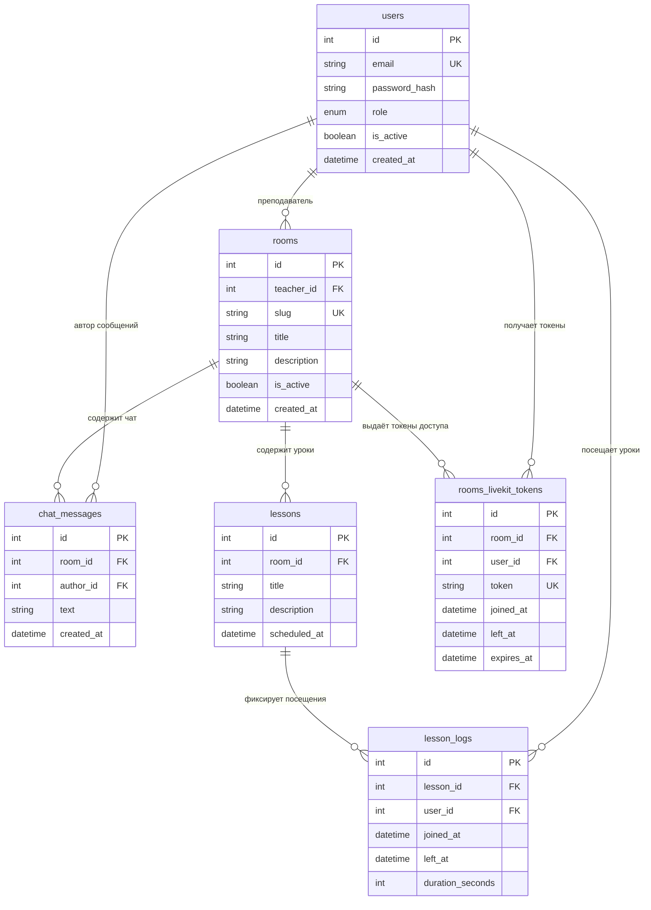

```mermaid
erDiagram
    users {
        int id PK
        string email UK
        string password_hash
        enum role
        boolean is_active
        datetime created_at
    }

    rooms {
        int id PK
        int teacher_id FK
        string slug UK
        string title
        string description
        boolean is_active
        datetime created_at
    }

    chat_messages {
        int id PK
        int room_id FK
        int author_id FK
        string text
        datetime created_at
    }

    lessons {
        int id PK
        int room_id FK
        string title
        string description
        datetime scheduled_at
    }

    lesson_logs {
        int id PK
        int lesson_id FK
        int user_id FK
        datetime joined_at
        datetime left_at
        int duration_seconds
    }

    rooms_livekit_tokens {
        int id PK
        int room_id FK
        int user_id FK
        string token UK
        datetime joined_at
        datetime left_at
        datetime expires_at
    }

    users ||--o{ rooms : "преподаватель"
    rooms ||--o{ chat_messages : "содержит чат"
    users ||--o{ chat_messages : "автор сообщений"
    rooms ||--o{ lessons : "содержит уроки"
    lessons ||--o{ lesson_logs : "фиксирует посещения"
    users ||--o{ lesson_logs : "посещает уроки"
    rooms ||--o{ rooms_livekit_tokens : "выдаёт токены доступа"
    users ||--o{ rooms_livekit_tokens : "получает токены"
```
